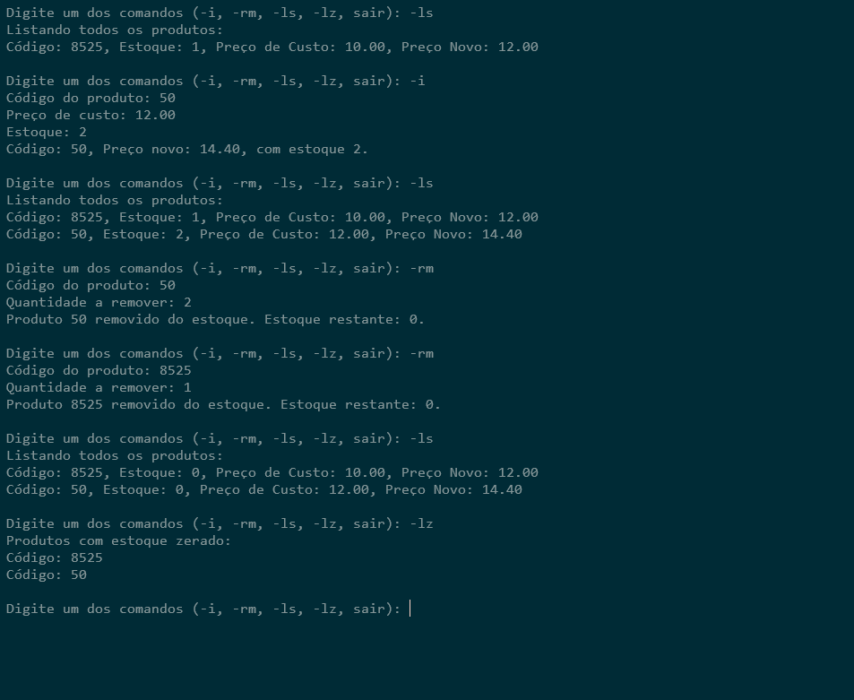

# StockManager Application

## Introdução
Este repositório contém a aplicação StockManager, que gerencia estoques e preços de forma eficiente utilizando Docker.

## Pré-requisitos
Antes de começar, verifique se você tem o Docker instalado na sua máquina. Você pode baixar o Docker [aqui](https://www.docker.com/products/docker-desktop).

## Como Construir e Executar

### 1. Construir a Imagem Docker
Para construir a imagem da aplicação, execute o seguinte comando no diretório onde está o Dockerfile:

```bash
docker build -t Image_StockManager .
```
### 2. Executar a Imagem Docker
Após a construção da imagem, você pode executar um contêiner interativo com o seguinte comando.
```bash
docker run --rm -it Image_StockManager
```
Este comando executa a imagem ```Image_StockManager``` em um contêiner interativo. A opção ```--rm``` remove o contêiner automaticamente após o término da execução.

### 3. Executar um Contêiner com um Nome Específico
Se precisar de um ambiente interativo para depuração ou desenvolvimento, utilize: 
``` bash
docker run --name meu_container -it Image_StockManager /bin/bash
```
Este comando cria e executa um contêiner chamado ``` meu_container ``` a partir da imagem ``` Image_StockManager ```, iniciando um shell bash interativo dentro dele.

### 4.  Copiar Arquivos do Contêiner para o Host ou o seu computador
substitua ``` [NOME-DO-CONTAINER] ``` pelo nome do container.

Para copiar arquivos do contêiner para o seu sistema local, utilize:
``` bash
docker cp [NOME-DO-CONTAINER]:/src/App_StockManager.exe "F:\\www\\c\\apps\\"

```
Este comando copia o conteúdo do diretório ``` /src/App_StockManager ``` do contêiner ``` [NOME-DO-CONTAINER] ``` para o diretório ``` F:\www\c\apps\ ``` no seu sistema local. Certifique-se de que o contêiner esteja em execução e que o caminho de destino exista.

<div>
    
</div>
